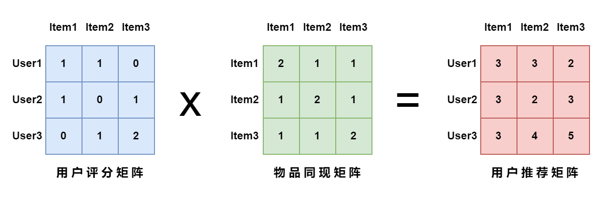

# 基于物品的协同过滤（ItemCF）

## 难易程度：*** 难

## 待完成：

* 请在 DSPPCode.mapreduce.item_cf.impl 中创建 CoOccurrenceMapperImpl, 继承 CoOccurrenceMapper, 实现抽象方法
* 请在 DSPPCode.mapreduce.item_cf.impl 中创建 CoOccurrenceReducerImpl, 继承 CoOccurrenceReducer, 实现抽象方法
* 请在 DSPPCode.mapreduce.item_cf.impl 中创建 RecommendMapperImpl, 继承 RecommendMapper, 实现抽象方法
* 请在 DSPPCode.mapreduce.item_cf.impl 中创建 RecommendReducerImpl, 继承 RecommendReducer, 实现抽象方法

## 题目描述：

* 背景：协同过滤是推荐系统中的常用算法，可以分为基于物品的协同过滤（ItemCF）和基于用户的协同过滤（UserCF）两类，本题只涉及 ItemCF。ItemCF 的核心思想就是“物以类聚”，即为用户推荐与用户喜欢的物品相似的物品。物品相似度的计算取决于大量用户的行为数据。如用户 A 对物品 1 进行了点赞，而对物品 1 点赞的所有用户中有很大一部分也对物品 2 进行了点赞，那么我们就可以说物品 1 与 物品 2 具有较高的相似度，从而把物品 2 推荐给用户 A。下面给出 ItemCF 算法中的一些关键定义：

  * **用户评分矩阵**：矩阵的行表示用户，列表示物品，元素值表示用户对物品的“评分”，这里的评分往往是由用户的隐式反馈累计而来，如点赞计 1 分，收藏计 2 分等。**当评分大于零时，表示用户喜欢对应物品**。如果用户未对某个物品产生行为，则值为 0。
  * **物品同现矩阵**：矩阵的行和列均表示物品，元素值表示同时喜欢两个物品的用户数。
  * **用户推荐矩阵**：矩阵的行表示用户，列表示物品，元素值表示推荐度，推荐度越高，表示用户喜欢该物品的可能性越大。给某个用户进行推荐时，返回矩阵对应行推荐度 topk 的物品（需要去除用户已经产生行为的物品）。

  下图给出了用户推荐矩阵的计算方式：**用户推荐矩阵 = 用户评分矩阵 * 物品同现矩阵**。

  

* 要求：给定用户评分矩阵，先计算物品同现矩阵，然后计算用户推荐矩阵。为了更加符合真实场景，**所有矩阵均采用稀疏矩阵的存储形式**。

* 输入格式

  用户评分矩阵，每行三个数字，分别是行号（用户编号）、列号（物品编号）、评分，中间使用 Tab 分割。为了简化，**这里的分数均为大于零的整数**。

  ```
  1	1	1
  1	2	1
  2	1	1
  2	3	1
  3	2	1
  3	3	2
  ```

* 输出格式

  物品同现矩阵，每行三个数字，分别是行号（物品编号）、列号（物品编号）、值，中间使用 Tab 分割。

  ```
  1	1	2
  1	2	1
  1	3	1
  2	1	1
  2	2	2
  2	3	1
  3	1	1
  3	2	1
  3	3	2
  ```

  用户推荐矩阵，每行三个数字，分别是行号（用户编号）、列号（物品编号）、推荐度，中间使用 Tab 分割。
  
  ```
  1	1	3
  1	2	3
  1	3	2
  2	1	3
  2	2	2
  2	3	3
  3	1	3
  3	2	4
  3	3	5
  ```
  
  

